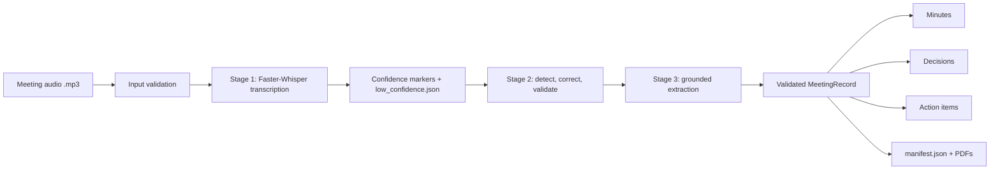

# InterIIT Meeting Assistant

Turns an English meeting recording into a timestamped transcript, a
terminology-refined transcript, grounded meeting minutes, key decisions and
action items — with a web UI, PDF export and a machine-readable JSON record.

## Problem

Meeting recordings contain decisions and follow-ups, but manually
transcribing, correcting domain terminology, and preparing minutes is slow and
error-prone. Asking an LLM to "summarise the meeting" is fast but unreliable:
it can silently rewrite what was said or invent owners, deadlines and
decisions.

## Solution

A three-stage pipeline in which every LLM step is bounded by deterministic
checks:

| Stage | What it does | Technology |
|---|---|---|
| 1. Transcription | Audio → timestamped transcript with per-word confidence; low-confidence words are marked | Faster-Whisper (`large-v3-turbo`), GPU with CPU fallback |
| 2. Refinement | Corrects likely ASR/terminology errors only where an error is detected, then validates the result | Groq LLM + deterministic integrity checks |
| 3. Documentation | Refined transcript → structured `MeetingRecord` → minutes, decisions, action items | Groq LLM + Pydantic validation + evidence grounding (RapidFuzz) + Jinja templates |

Reliability safeguards:

- **Detect before correcting.** Stage 2 pre-detects errors per chunk; chunks
  that look plausible are passed through unchanged.
- **Correction, not generation.** Semantic changes are allowed only for words
  listed in `low_confidence.json`. A final integrity check against
  `raw_transcript.txt` fails the pipeline on any unauthorized addition,
  deletion or word change, before minutes are generated. Retry the run if this
  check fails.
- **Grounded extraction.** Stage 3 decisions and action items must match
  evidence in the transcript; unsupported items are dropped rather than
  reported.

## Architecture



## Repository layout

```text
.
├── final codes/              # The real-audio pipeline
│   ├── Stage_1.py            #   transcription + confidence analysis
│   ├── stage2_refine_clean.py#   guarded transcript refinement
│   ├── stage3_minutes.py     #   grounded minutes / decisions / actions
│   ├── pipeline.py           #   orchestrator and CLI
│   ├── prompts/              #   Stage 2 and Stage 3 LLM prompts
│   ├── templates/            #   Jinja templates for Markdown outputs
│   └── outputs/              #   cached sample run (used by "Load sample recording")
├── src/interiit/
│   ├── server.py             # FastAPI server: upload, progress stream, PDF/ZIP export
│   ├── cli.py, pipeline.py   # offline deterministic demo
│   └── stages/, renderers/, models.py, config.py, errors.py
├── web/index.html            # web UI served by the FastAPI server
├── data/sample_meeting.json  # fixture for the offline demo
├── Recordings/example.mp3    # short example recording
├── scripts/evaluate_baseline.py
├── tests/
├── docs/                     # detailed per-stage documentation
├── .env.example              # copy to .env for the real-audio pipeline
├── pyproject.toml, uv.lock   # uv project (Python 3.11)
├── requirements.txt          # pip alternative
└── run_demo.ps1              # one-step offline demo
```

## Setup

Prerequisites: Python 3.11+ and [uv](https://docs.astral.sh/uv/). The web app
additionally needs [FFmpeg](https://ffmpeg.org/) (`ffprobe`) on `PATH` to
validate uploaded audio.

```powershell
uv sync
```

For the real-audio pipeline and web app, create a `.env` from the example and
add a [Groq API key](https://console.groq.com/keys):

```powershell
Copy-Item .env.example .env
```

| Variable | Required | Default | Purpose |
|---|---|---|---|
| `GROQ_API_KEY` | Yes (Stages 2 and 3) | — | Authenticates LLM requests |
| `LLM_PROVIDER` | No | `groq` | Stage 2 provider (only `groq` is supported) |
| `LLM_MODEL` | No | `openai/gpt-oss-20b` | Stage 2 refinement model |
| `DOC_LLM_MODEL` | No | `openai/gpt-oss-120b` | Stage 3 documentation model |

The offline demo needs no `.env`, API key, or model download.

<details>
<summary>Alternative: pip</summary>

```powershell
python -m venv .venv
.\.venv\Scripts\Activate.ps1
python -m pip install -r requirements.txt
$env:PYTHONPATH = "src"
```

Then drop the `uv run` prefix from the commands below.
</details>

## Usage

### 1. Offline demo (no API key)

Runs the deterministic pipeline on the bundled transcript fixture:

```powershell
.\run_demo.ps1          # equivalent: uv run interiit
```

Outputs are written to `outputs/demo/`: `raw_transcript.txt`,
`raw_transcript.json`, `refined_transcript.txt`, `minutes.md`,
`key_decisions.md`, `action_items.md`, `meeting_record.json`, `manifest.json`.

### 2. Web app

```powershell
uv run uvicorn interiit.server:app
```

Open <http://127.0.0.1:8000>. Either:

- click **Load sample recording** to replay a cached run of a 10-minute
  council meeting (no API key or model needed), or
- upload an `.mp3` to run the full pipeline (requires `GROQ_API_KEY`; the
  Whisper model is downloaded on first use).

Stage progress is streamed live, and each document (raw transcript, refined
transcript, decisions, action items, minutes) can be previewed and downloaded
as a PDF or all together as a ZIP. Per-run files are stored under `runs/`.

### 3. Real-audio pipeline from the command line

```powershell
uv run python "final codes/pipeline.py" "Recordings/example.mp3" --out "outputs/example"
```

This additionally writes `marked_transcript.txt`, `low_confidence.json` and
`change_log.json` (every Stage 2 change with its justification).

### Tests and baseline report

```powershell
uv run pytest
uv run python scripts/evaluate_baseline.py   # run the offline demo first
```

## Baseline evaluation

The bundled fixture contains one explicit decision and two explicit action
items. The deterministic offline extractor reports:

| Metric | Result |
|---|---:|
| Decision extraction precision | 1.00 |
| Decision extraction recall | 1.00 |
| Action-item extraction precision | 1.00 |
| Action-item extraction recall | 1.00 |
| External calls in offline mode | 0 |

These numbers are fixture-level sanity metrics, not a claim of general
language understanding. A larger labelled meeting set is required for a
credible benchmark.

## Documentation

Detailed design notes are in `docs/`:

- [Project structure and pipeline flow](docs/PROJECT_STRUCTURE_AND_PIPELINE.md)
- [Stage 1 — transcription workflow](docs/STAGE_1_WORKFLOW.md)
- [Stage 2 — refinement pipeline](docs/STAGE_2_PIPELINE.md)
  ([short version](docs/STAGE_2_JUDGE_PIPELINE.md))
- [Stage 3 — documentation pipeline](docs/STAGE_3_PIPELINE.md)

## Limitations

- English `.mp3` recordings only; no speaker diarization, and overlapping
  speech is not handled.
- The offline demo consumes the bundled transcript fixture and targets
  explicit patterns such as "agreed", "approved" and "will"; it does not
  decode audio.
- The real-audio path needs a Groq API key and is subject to that service's
  rate limits. Transcription is slow without a CUDA GPU.
- The server processes one recording at a time and keeps job state in memory.

## Future work

1. Speaker-aware diarization and a user-editable domain glossary.
2. Evaluation on a labelled corpus with citation-grounded faithfulness metrics.
3. Additional LLM providers and a fully local refinement model.
4. Calendar and task-tracker integrations for action items.

## Team

TL;DR_Audio

## License

MIT. See [LICENSE](LICENSE).
